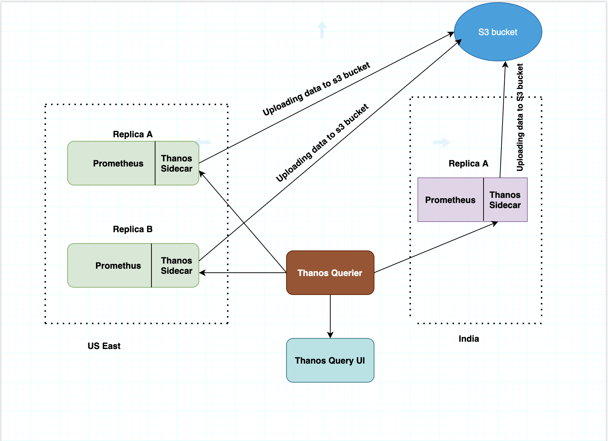
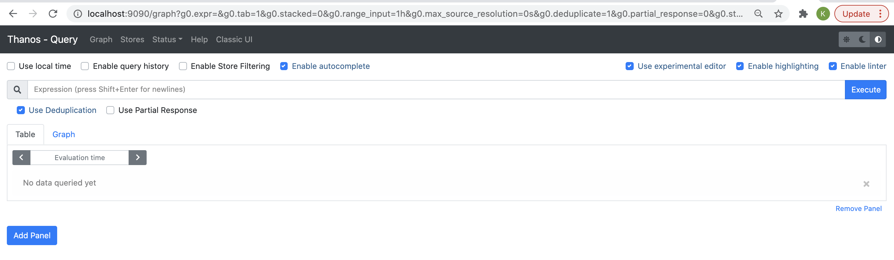
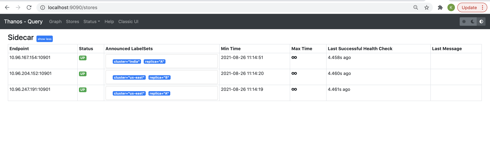
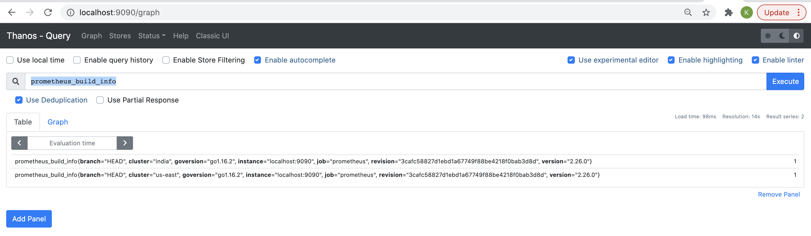
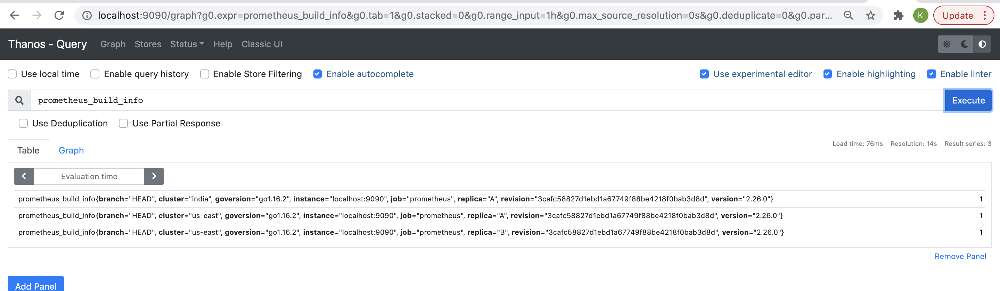
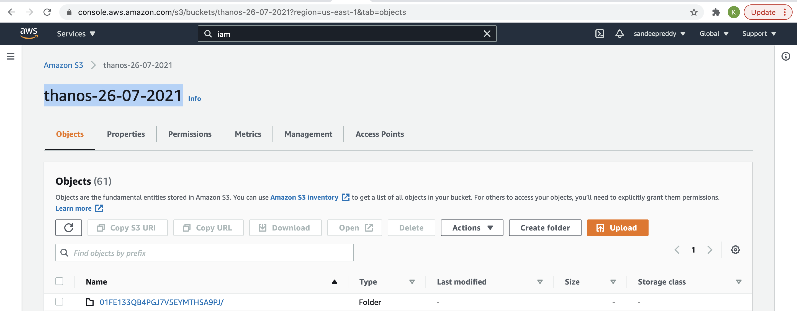
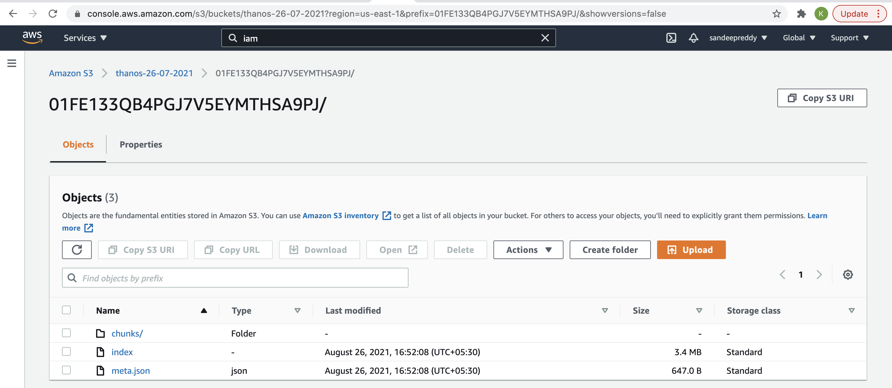

# Thanos - Opensource, Highly available Prometheus setup with long term storage capabilities 

- [Thanos](#thanos)
   - [Overview](#overview)
   - [Pre-requisites](#pre-requisites)
   - [Setup](#setup)
       - [step-1: Creating monitoring namespace](#step-1-creating-monitoring-namespace)
       - [step-2: Creating object storage secret](#step-2-creating-object-storage-secret)
       - [step-3: Creating Promtheus instances](#step-3-creating-promtheus-instances)
       - [step-4: Deploying thanos querier and querier frontend components](#step-4:-deploying-thanos-querier-and-querier-frontend-components)
       - [step-5: Verifying thanos features](#step-5:-verifying-thanos-features)


## Thanos
### Overview

`Thanos` is a opensource project which provides the following features.
- Global Query view
- Highly availability prometheus
- Unlimited retention i.e storing the metrics in object storage
- Downsampling & compaction

### Pre-requisites

- kubernetes cluster
- helm

### Setup

we will be working on 3 features of thanos i.e Global query view, Highly availability prometheus,Unlimited retention. So our setup looks as follows.



### step-1: Creating monitoring namespace

Let us create monitoring namespace. In this namespace we are going to install all prometheus instances.

```
kubectl create ns monitoring
```

### step-2: Creating object storage secret

`Thanos sidecar` sidecar container uploads metrics to Object storage. To make it happen we need to let the sidecar know about the s3 object configuration. We will go step by step.

First create s3 bucket

Go to AWS -> S3 -> create a bucket

for example:

bucket name -> thanos-26-07-2021
region -> us-east-1

After once the bucket is created, lets create an IAM policy restircting to this bucket. policy json below.

```
{
    "Version": "2012-10-17",
    "Statement": [
        {
            "Sid": "Statement",
            "Effect": "Allow",
            "Action": [
                "s3:ListBucket",
                "s3:GetObject",
                "s3:DeleteObject",
                "s3:PutObject"
            ],
            "Resource": [
                "arn:aws:s3:::thanos-26-07-2021/*",
                "arn:aws:s3:::thanos-26-07-2021"
            ]
        }
    ]
}
```

Create IAM policy with the above json content. for example

AWS -> IAM -> Policy -> create policy -> provide policy name as "thanos-storage" -> copy the above json content.

Create IAM user and attach the policy created.

AWS -> IAM -> Users -> provide name of the user as `thanos` & select `AWS Programatic access` and then attach the policy created(i.e thanos-storage"). You will get access key & secret access key. Make a note of it.

Then update the access key, secret access key, region, endpoint, bucket details in [object-storage-config.yaml](./object-storage/object-storage-config.yaml)

then create object storage config secret

```
kubectl apply -f ./object-storage/object-storage-config.yaml
```

### step-3: Creating Promtheus instances

As explained earlier, we will be creating 3 prometheus instances(us-east-a,us-east-b,india-a)

```
# Prometheus Instance1 - us-east Replica A
helm install prom-us-east-a prometheus-community/prometheus -f ./prom-valuesfiles/prom-us-east-A-values.yml -n monitoring


# Prometheus Instance2 - us-east Replica B
helm install prom-us-east-b prometheus-community/prometheus -f ./prom-valuesfiles/prom-us-east-B-values.yml -n monitoring

# Prometheus Instance3 - India Replica A
helm install prom-india-a prometheus-community/prometheus -f ./prom-valuesfiles/prom-india-A-values.yml -n monitoring
```

Wait until all the pods come in up & running status.

kubectl get pods -n monitoring

### step-4: Deploying thanos querier and querier frontend components

Now lets deploy other thanos components i.e thanos querier, thanos querier frontend etc etc.
Run the below command.

```
kubectl apply -f ./thanos
```

### step-5: Verifying thanos features

Run the port forward against `thanos-query-frontend` pod.

```
kubectl -n monitoring port-forward svc/thanos-query-frontend 9090:9090
```
you should see thanos ui at http://localhost:9090. 



UI looks similar to prometheus however if you observe closely there are some differences. for example 'stores' option at the top. Click `stores` from the menu. it should display all the 3 prometheus instances details.



now lets test all the features

**Global Query view**

Go to thanos ui(localhost:9090) -> Graph -> in the search bar enter `prometheus_build_info` and click Execute. It displays 2 entries because US-EAST has 2 replicas, so thanos querier has de-duplicated and displayed only 1 for us-east region. Screenshots below

with Deduplication:




Without Deduplication:

Uncheck the `Use Deduplication` option in the UI.



With this we can confirm that `Thanos querier UI` will be able to query the metrics of all the configured prometheus instances & also deduplicates the replica ones.

**Object storage**

`Thanos sidecar` uploads the data to s3 bucket. how frequently the data will be sent/uploaded is based on the setting `storage.tsdb.min-block-duration` & `storage.tsdb.max-block-duration`.
For a testing purpose I have set 5m(5 minutes) in [prometheus values files](prom-valuesfiles). recommended values are 2h(2 hours).

**Note** Makesure you provide same values for both `storage.tsdb.min-block-duration` & `storage.tsdb.max-block-duration` for ex: 2h for both min & max.

Now go to s3 bucket.

AWS Console -> s3 bucket(thanos-26-07-2021)




